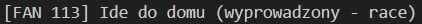
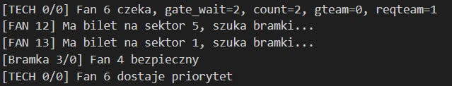
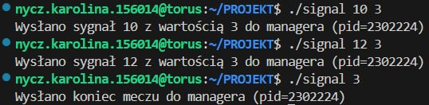
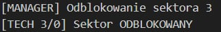
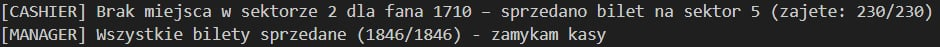
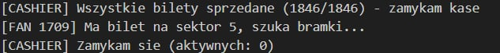
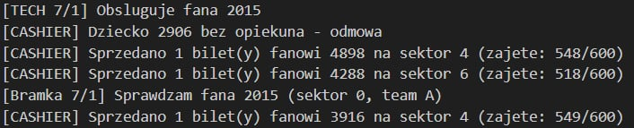
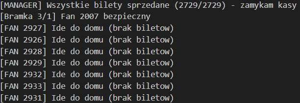
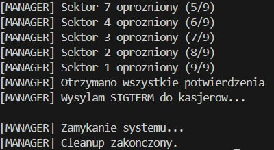

## Hala widowiskowo-sportowa 

# 1. Ogólny opis projektu

Projekt polega na symulacji systemu obsługi kibiców na stadionie, działającego w środowisku Linux/UNIX z wykorzystaniem mechanizmów komunikacji międzyprocesowej.

System składa się z kilku współpracujących typów procesów: managera, kasjerów, techników oraz kibiców, które komunikują się ze sobą przy użyciu pamięci współdzielonej, kolejek komunikatów, semaforów oraz sygnałów systemowych.

Każdy kibic funkcjonuje jako niezależny proces, realizując cykl: wejście do systemu → zakup biletu → kontrola przy bramce → wejście na sektor → opuszczenie stadionu podczas ewakuacji. Przebieg tego cyklu zależy od dostępności miejsc w sektorach, liczby aktywnych kas, przynależności do drużyny, statusu VIP oraz losowych zdarzeń.

Liczba kasjerów jest dynamiczna i zależna od aktualnego obciążenia systemu oraz długości kolejek. Ograniczenia systemowe obejmują m.in. maksymalną pojemność sektorów, ograniczoną przepustowość bramek, możliwość blokowania sektorów oraz konieczność przeprowadzenia ewakuacji w sytuacjach awaryjnych.

Manager zarządza globalnym stanem systemu poprzez uruchamianie i zamykanie procesów kasjerów, wysyłanie sygnałów do pozostałych procesów oraz inicjowanie procedury ewakuacji. Technicy odpowiadają za kontrolę wejść do sektorów, obsługę kolejek przy bramkach oraz potwierdzanie opróżnienia sektorów. Kasjerzy realizują sprzedaż biletów i przydzielanie miejsc, natomiast kibice symulują zachowanie uczestników wydarzenia.

Cała symulacja generuje raport tekstowy zapisywany do pliku `raport.txt`, dokumentujący przebieg działania systemu, istotne zdarzenia oraz aktualne stany procesów.

Projekt ma na celu praktyczne wykorzystanie i zaprezentowanie mechanizmów zarządzania procesami, synchronizacji, komunikacji międzyprocesowej, obsługi sygnałów oraz pracy na zasobach systemowych w środowisku Linux/UNIX.

# 2. Ogólny opis kodu

Projekt został podzielony na kilka logicznie rozdzielonych plików źródłowych, z których każdy odpowiada za odrębny element symulowanego systemu. Współpraca pomiędzy modułami odbywa się za pośrednictwem mechanizmów IPC oraz wspólnych struktur danych zdefiniowanych w common.h.

Każdy plik realizuje określoną funkcję w strukturze programu i odpowiada za obsługę wybranego typu procesu lub mechanizmu systemowego. Współpraca pomiędzy modułami odbywa się za pośrednictwem mechanizmów IPC oraz wspólnych struktur danych.

Podział kodu na osobne pliki umożliwia niezależne rozwijanie poszczególnych elementów systemu, ogranicza powstawanie błędów wynikających z nadmiernych zależności oraz ułatwia analizę działania programu.

Takie podejście pozwala na zachowanie modularności projektu oraz zapewnia większą przejrzystość implementacji.

## 2.1 Struktura projektu

Projekt składa się z następujących plików źródłowych:

- `manager.c`  
  Główny proces systemu. Odpowiada za inicjalizację zasobów IPC, uruchamianie pozostałych procesów, zarządzanie kasami oraz nadzorowanie przebiegu symulacji i ewakuacji.

- `cashier.c`  
  Implementuje proces kasjera. Obsługuje sprzedaż biletów, sprawdza dostępność miejsc w sektorach oraz komunikuje się z kibicami za pomocą kolejek komunikatów.

- `tech.c`  
  Realizuje proces technika obsługującego bramki. Kontroluje wejścia do sektorów, zarządza kolejkami przy bramkach oraz nadzoruje opróżnianie sektorów podczas ewakuacji.

- `fan.c`  
  Implementuje proces kibica. Symuluje zachowanie uczestnika wydarzenia, w tym zakup biletu, wejście na stadion oraz reakcję na sytuacje awaryjne.

- `common.c`  
  Zawiera funkcje pomocnicze wykorzystywane przez wszystkie moduły, m.in. obsługę logowania, inicjalizację pamięci współdzielonej, kolejek komunikatów oraz semaforów.

- `common.h`  
  Plik nagłówkowy zawierający definicje struktur danych, stałych, typów komunikatów oraz deklaracje funkcji wspólnych dla całego projektu.

- `signal.c`  
Narzędzie pomocnicze do ręcznego sterowania działającą symulacją z poziomu wiersza poleceń. Umożliwia wysyłanie sygnałów do procesu managera – blokowanie i odblokowywanie wybranych sektorów (za pomocą SIGUSR1/SIGUSR2 z wartością numeru sektora przekazaną przez sigqueue) oraz wymuszenie zakończenia meczu (przez SIGTERM). PID managera wykrywany jest automatycznie przy użyciu pgrep.

- `Makefile`  
Plik budowania projektu oparty na narzędziu make. Definiuje reguły kompilacji dla wszystkich pięciu plików wykonywalnych (manager, cashier, tech, fan, signal) z flagami -Wall -Wextra -pedantic -std=c11 -g oraz linkuje bibliotekę matematyczną (-lm). Clean usuwa wszystkie pliki wynikowe oraz plik raportu raport.txt.  

## 2.2 Zastosowane rozwiązania zwiększające wydajność i stabilność

W celu zapewnienia poprawnego, stabilnego i wydajnego działania systemu zastosowano następujące rozwiązania:

- **Synchronizacja dostępu do danych**  
  Do kontroli dostępu do pamięci współdzielonej wykorzystano semafory System V, co zapobiega jednoczesnej modyfikacji wspólnych struktur danych przez wiele procesów.

- **Asynchroniczna komunikacja międzyprocesowa**  
  Zastosowanie kolejek komunikatów umożliwia wymianę informacji pomiędzy procesami bez konieczności ich bezpośredniej synchronizacji.

- **Nieblokujące operacje IPC**  
  Wykorzystanie trybu `IPC_NOWAIT` zapobiega trwałemu blokowaniu procesów i zwiększa płynność działania symulacji.

- **Obsługa sygnałów systemowych**  
  Mechanizmy obsługi sygnałów pozwalają na bezpieczne reagowanie na zdarzenia awaryjne, takie jak zakończenie programu, blokada sektorów czy ewakuacja.

- **Dynamiczne zarządzanie zasobami**  
  Liczba aktywnych kasjerów jest dostosowywana do aktualnego obciążenia systemu, co pozwala na efektywne wykorzystanie dostępnych zasobów.

- **Kontrola przepustowości bramek**  
  Ograniczenie liczby jednocześnie obsługiwanych kibiców na bramkach zmniejsza ryzyko przeciążenia systemu.

- **Mechanizm priorytetów**  
  Wprowadzenie priorytetu dla wybranych kibiców zapobiega długiemu oczekiwaniu i poprawia realizm symulacji.

- **Rejestrowanie zdarzeń**  
  Wszystkie istotne operacje są zapisywane w pliku `raport.txt`, co ułatwia analizę działania systemu oraz wykrywanie błędów.

- **Kontrola poprawności działania procesów**  
  Zastosowanie obsługi sygnału `SIGCHLD` umożliwia usuwanie procesów zombie i poprawia stabilność systemu.

# 3. Zrealizowane elementy projektu

- **Kasy biletowe**
  
  - Zawsze działają minimum 2 stanowiska kasowe  
  - Dynamiczne otwieranie kas, gdy kolejka przekracza próg `(K/10) * N`  
  - Dynamiczne zamykanie kas, gdy kolejka spada poniżej `(K/10) * (N - 1)`  
  - Jeden kibic może kupić maksymalnie 2 bilety w tym samym sektorze  
  - Kasy automatycznie zamykane po sprzedaży wszystkich biletów  
  - Obsługa klientów VIP z pominięciem kolejki (limit `0,3% * K`)  
  - Bilety sprzedawane losowo przez wszystkie kasy  

- **Sektory i pojemność**

  - 8 sektorów dla kibiców o równej pojemności  
  - Dodatkowy sektor VIP  
  - Monitorowanie i blokowanie sprzedaży po osiągnięciu limitu sektora  

- **Kontrola bezpieczeństwa przy bramkach**

  - Osobne wejście do każdego z 8 sektorów  
  - 2 stanowiska kontrolne na każdym wejściu  
  - Maksymalnie 3 osoby jednocześnie na stanowisku  
  - Gwarancja, że kibice kontrolowani równocześnie należą do tej samej drużyny  
  - Mechanizm priorytetów — kibic może zostać przepuszczony maksymalnie 5 razy, po czym otrzymuje pierwszeństwo  
  - Osobne wejście dla VIP-ów bez kontroli bezpieczeństwa  
  - Dzieci poniżej 15. roku życia wpuszczane tylko pod opieką osoby dorosłej  
  - Wykrywanie i usuwanie kibiców z racami  

- **Sygnały i ewakuacja**
  
  - `SIGUSR1` — wstrzymanie wpuszczania kibiców do sektorów  
  - `SIGUSR2` — wznowienie wpuszczania kibiców  
  - `SIGTERM` — ewakuacja wszystkich kibiców ze stadionu  
  - Pracownik techniczny wysyła potwierdzenie do kierownika po opróżnieniu sektora  

- **Kierownik (manager)**
  
  - Inicjalizacja wszystkich zasobów IPC  
  - Uruchamianie i zamykanie procesów kasjerów, techników i kibiców  
  - Obsługa sygnałów i nadzorowanie przebiegu całej symulacji  
  - Automatyczna ewakuacja po zakończeniu meczu lub przekroczeniu pojemności  

- **Raport**
  
  - Zapis przebiegu symulacji do pliku `raport.txt`  
  - Synchronizowane logowanie z użyciem semaforów  

# 4. Napotkane problemy i trudności

Podczas realizacji projektu napotkano szereg problemów związanych z programowaniem współbieżnym oraz komunikacją międzyprocesową.

- **Ryzyko występowania zakleszczeń (deadlocków)**  
  Niewłaściwe użycie semaforów mogło prowadzić do sytuacji, w których procesy wzajemnie się blokowały. Problem ten został rozwiązany poprzez ujednolicenie kolejności blokowania zasobów.

- **Obsługa sygnałów systemowych**  
  Trudnością było zapewnienie poprawnej reakcji procesów na sygnały ewakuacji i zakończenia pracy bez utraty danych oraz pozostawienia zasobów w niepoprawnym stanie.

- **Zarządzanie zasobami IPC**  
  Konieczne było pilnowanie poprawnego tworzenia i usuwania pamięci współdzielonej, kolejek komunikatów oraz semaforów, aby uniknąć wycieków zasobów.

- **Synchronizacja kolejek przy bramkach**  
  Implementacja kolejek wejściowych wymagała dodatkowej kontroli, aby zapobiec utracie danych oraz niepoprawnej kolejności obsługi kibiców.

Napotkane trudności pozwoliły na zdobycie praktycznego doświadczenia w programowaniu współbieżnym oraz lepsze zrozumienie mechanizmów systemów operacyjnych.

# 5. Wyróżniające się elementy specjalne

Projekt zawiera kilka istotnych rozwiązań, które zwiększają jego funkcjonalność oraz poziom zaawansowania.

- **Dynamiczne zarządzanie kasjerami**  
  Automatyczne otwieranie i zamykanie kas w zależności od liczby oczekujących kibiców.

- **Obsługa klientów VIP**  
  Priorytetowa obsługa wybranych kibiców podczas zakupu biletów.

- **System priorytetów przy bramkach**  
  Przyznawanie pierwszeństwa kibicom długo oczekującym w kolejce.

- **Wykrywanie i usuwanie kibiców z racami**
  umożliwia wykrycie niebezpiecznych kibiców i ich usunięcie z systemu.

- **Obsługa kibiców niepełnoletnich**
  dzieci poniżej 15. roku życia mogą wejść wyłącznie pod opieką dorosłego, co jest weryfikowane przez kasjera

- **Synchronizowane logowanie zdarzeń**  
  Zabezpieczenie zapisu do pliku `raport.txt` przy użyciu semaforów.

- **Automatyczne proponowanie alternatywnego sektora**  
  Jeśli wybrany przez kibica sektor jest pełny, kasjer automatycznie wyszukuje wolne miejsce w innym sektorze i przydziela bilet tam, zamiast odmawiać sprzedaży.
  
  # 6. Opis semaforów

W projekcie zastosowano zestaw semaforów System V w celu synchronizacji dostępu do zasobów współdzielonych oraz zapewnienia poprawnej współpracy pomiędzy procesami.

Wykorzystywane semafory pełnią następujące funkcje:

- **Semafor 0 – synchronizacja logowania**  
  Odpowiada za kontrolę dostępu do funkcji zapisujących dane do pliku `raport.txt`, zapobiegając nakładaniu się komunikatów z różnych procesów.

- **Semafor 1 – kolejki bramkowe**  
  Chroni dostęp do struktur `gate_queue` przechowywanych w pamięci współdzielonej.  
  Używany przez techników i kibiców przy dodawaniu i usuwaniu elementów z kolejki.

- **Semafor 2 – ewakuacja i blokady sektorów**  
  Zabezpiecza odczyt i zapis flagi `evacuation` oraz tablicy `sector_blocked`.  
  Używany przez managera przy inicjowaniu ewakuacji oraz obsłudze sygnałów `SIGUSR1` / `SIGUSR2`.

- **Semafor 3 – dane globalne**  
  Chroni wszystkie liczniki ogólnosystemowe, takie jak:
  - liczba sprzedanych biletów,
  - liczba kibiców na stadionie,
  - liczba aktywnych kasjerów,
  - rozmiary kolejek do kas.

- **Semafory 4 + i – dane sektorów**  
  Każdy sektor posiada własny semafor, który chroni dane konkretnego sektora i (sector_taken, sector_tickets_sold, gate_count), umożliwiając jednoczesne         operacje na różnych sektorach bez wzajemnego blokowania procesów.
  
Zastosowanie oddzielnych semaforów dla poszczególnych obszarów systemu pozwala na ograniczenie liczby blokad, zwiększenie równoległości działania oraz poprawę wydajności symulacji.

  # 7. Przeprowadzone testy

  ## 7.1 Proponowanie wolnego sektora
  
    
  - Kibic podczas zakupu biletu wskazuje preferowany sektor. Jeśli w danym sektorze brakuje wolnych miejsc, kasjer automatycznie przeszukuje pozostałe sektory     i przydziela bilet w pierwszym dostępnym. Kibic zostaje poinformowany o zmianie sektora i kontynuuje proces wejścia na stadion bez konieczności ponownego      ustawiania się w kolejce do kasy.  
    
 **Test potwierdza, że:**

- Kasjer poprawnie wykrywa brak miejsc w sektorze  
  System blokuje sprzedaż biletu w przypadku osiągnięcia maksymalnej pojemności danego sektora.

- System nie odmawia sprzedaży biletu przy dostępności miejsc w innych sektorach  
  W sytuacji braku miejsc w wybranym sektorze kasjer proponuje alternatywny sektor z wolną pojemnością.  

  ## 7.2 Wykrywanie zagrożenia
    
    
    
- Kibic posiadający race zostaje zatrzymany przez technika podczas kontroli przy bramce. Technik wysyła do kibica odpowiedź z wartością `-1`, która sygnalizuje wyprowadzenie ze stadionu. Kibic nie wchodzi na sektor i opuszcza system.

**Test potwierdza, że:**

- Technik poprawnie wykrywa kibica z racami  
  System identyfikuje flagę `has_flare` podczas kontroli przy bramce i natychmiast przerywa proces wejścia na stadion.

- Kibic z racami nie wchodzi na sektor  
  Po otrzymaniu odpowiedzi `-1` kibic kończy działanie bez inkrementowania liczników `sector_taken` oraz `total_taken`.

- Liczniki są poprawnie aktualizowane po wyprowadzeniu  
  System dekrementuje `sector_tickets_sold` oraz `total_tickets_sold`, zwalniając miejsce dla innych kibiców.  

## 7.3 Odmowa sprzedaży biletu dziecku bez opiekuna

     
- Dziecko poniżej 15. roku życia może pojawić się w systemie bez przypisanego opiekuna, jednak jest to zdarzenie rzadkie — każdy dorosły może być opiekunem tylko jednego dziecka, a dziecko bez opiekuna pojawia się wyłącznie wtedy, gdy w systemie nie ma wolnego dorosłego. Na potrzeby testu zwiększono prawdopodobieństwo losowania dzieci. Kasjer wykrywa brak opiekuna i odmawia sprzedaży biletu, a dziecko opuszcza system.  

**Test potwierdza, że:**  

- Kasjer poprawnie weryfikuje obecność opiekuna  
  System sprawdza pole `guardian` w żądaniu zakupu biletu i odmawia sprzedaży, gdy jego wartość wynosi `0`.  

- Dziecko bez opiekuna nie wchodzi na stadion  
  Po otrzymaniu odmowy kibic kończy działanie i opuszcza system bez przydzielonego biletu ani sektora.

 ## 7.4 Mechanizm priorytetu przy bramce

- Kibic oczekujący na wejście do sektora może zostać przepuszczony przez fanów innej drużyny, jednak po przekroczeniu limitu oczekiwania technik przyznaje mu priorytet i wpuszcza go poza kolejnością. Mechanizm priorytetu jest trudny do wywołania w normalnych warunkach — system działa na tyle sprawnie, że bramki rzadko pozostają zajęte przez kibiców innej drużyny przez dłuższy czas. Priorytet reprezentuje sytuację niepożądaną, oznaczając frustrację kibica, który został przepuszczony zbyt wiele razy.  
- Na potrzeby testu sztucznie zainicjowano bramkę sektora `0` jako zajętą przez drużynę A oraz spowolniono technika, aby umożliwić kibicom drużyny B dłuższe oczekiwanie.

**Test potwierdza, że:**

- Technik poprawnie wykrywa długo oczekującego kibica  
  System śledzi liczbę przepuszczeń w polu `gate_wait` i przyznaje priorytet po przekroczeniu ustalonego limitu.

- Kibic z priorytetem jest wpuszczany poza kolejnością  
  Po otrzymaniu priorytetu kibic wchodzi na bramkę niezależnie od drużyny aktualnie kontrolowanej.

- Kibic zostaje poinformowany o otrzymaniu priorytetu  
  W pliku `raport.txt` pojawiają się wpisy `Fan X dostaje priorytet`.

## 7.5 Test sygnałów

  
  
  
  
- Manager nasłuchuje sygnałów `SIGUSR1` i `SIGUSR2` wysyłanych przez pomocniczy program `signal`. Sygnał 1 blokuje wskazany sektor, uniemożliwiając technikom wpuszczanie kibiców przez bramki. Sygnał 2 odblokowuje sektor i wznawia normalną obsługę. Do przesłania numeru sektora wraz z sygnałem wykorzystano mechanizm `sigqueue` z wartością `si_value.sival_int`.  
  Na potrzeby testu uruchomiono system, a następnie z drugiego terminala wysłano sygnał blokady dla sektora `3`, odczekano kilka sekund i wysłano sygnał odblokowania.  

**Test potwierdza, że:**  

- Manager poprawnie odbiera sygnał z wartością  
  Handler `block_handler` odczytuje numer sektora z `siginfo_t` i ustawia flagę `sector_blocked[sector] = 1` w pamięci współdzielonej.

- Technik wstrzymuje obsługę podczas blokady  
  W pliku `raport.txt` pojawiają się wpisy `[TECH x/x] Sektor ZABLOKOWANY`, a technik oczekuje bez wpuszczania kibiców.

- Po odblokowaniu obsługa wraca do normy  
  Po odebraniu sygnału 2 flaga zostaje wyzerowana i pojawia się wpis `[TECH x/x] Sektor ODBLOKOWANY`.

  

- Manager nasłuchuje sygnału `SIGTERM`, który symuluje zakończenie meczu. Po jego odebraniu manager ustawia flagę ewakuacji, wysyła `SIG_EVACUATE` do wszystkich procesów, oczekuje na potwierdzenia opróżnienia sektorów od techników, a następnie zamyka system, zwalniając wszystkie zasoby IPC.  
  Na potrzeby testu wysłano `SIGTERM` do managera przed naturalnym zakończeniem czasu meczu.  

**Test potwierdza, że:**  

- Manager poprawnie inicjuje procedurę zamknięcia  
  Po odebraniu sygnału pojawia się wpis `[MANAGER] Koniec meczu - wysylam sygnal do grupy procesow`.

- Wszystkie procesy kończą działanie  
  Technicy wysyłają potwierdzenia `MSG_SECTOR_EMPTY`, manager zbiera je wszystkie i wypisuje `[MANAGER] Otrzymano wszystkie potwierdzenia`.

- Zasoby IPC są poprawnie zwalniane  
  Po zakończeniu systemu brak wiszących zasobów — weryfikacja przez `ipcs` nie wykazuje pozostałości po kolejkach komunikatów, semaforach ani segmentach pamięci współdzielonej.

  ## 7.6 Dynamiczne zarządzanie kasami

  
  
  
  

- Liczba aktywnych kas dostosowuje się do długości kolejki kibiców oczekujących na bilet. Manager cyklicznie sprawdza rozmiar kolejki i otwiera nową kasę, gdy kolejka przekracza próg `(K/10) * N` (gdzie `N` oznacza liczbę aktywnych kas), oraz zamyka kasę, gdy kolejka spada poniżej `(K/10) * (N - 1)`. Zawsze aktywne są minimum dwie kasy, dopóki bilety nie zostaną wyprzedane.  
  Po wyprzedaniu wszystkich biletów manager zamyka wszystkie kasy i odsyła odmowy fanom, którzy zdążyli wysłać żądanie do kolejki wiadomości przed zamknięciem kas — bez tego mechanizmu oczekiwaliby oni w nieskończoność na odpowiedź.

**Test potwierdza, że:**  

- Manager poprawnie otwiera dodatkowe kasy przy rosnącej kolejce  
  W logach pojawiają się wpisy `Otwieram kase (kolejka=X, kasy=N->x)` w momencie przekroczenia progu.  

- Manager poprawnie zamyka nadmiarowe kasy przy malejącej kolejce  
  W logach pojawiają się wpisy `Zamykam kase (kolejka=X, kasy=N->x)` w momencie spadku poniżej progu.  

- Kasy zostają zamknięte po wyprzedaniu biletów  
  W logach managera pojawia się wpis `Wszystkie bilety sprzedane (X/X) - zamykam kasy`, a fani oczekujący w kolejce otrzymują odmowę i opuszczają system z komunikatem `Ide do domu (brak biletow)`.  

## 7.7 Test obciążeniowy — 3000 kibiców  

  
  
  

- Symulacja została przeprowadzona z dużą liczbą kibiców (`MAX_FANS = 3000`) w celu weryfikacji poprawności działania systemu pod dużym obciążeniem. Test sprawdza, czy wszystkie mechanizmy współpracują ze sobą poprawnie.  

**Test potwierdza, że:**  

- System poprawnie obsługuje 3000 równoległych procesów kibiców  
  Wszystkie procesy kończą działanie bez zawieszenia — kibice kupują bilety, przechodzą przez bramki lub wracają do domu po odmowie.  

- Bilety zostają w pełni wyprzedane  
  Manager wykrywa wyprzedanie i zamyka kasy, a pozostali kibice w kolejce otrzymują odmowę.  

- Semafory i kolejki wiadomości pozostają stabilne  
  Nie występują błędy `EFBIG` ani zawieszone procesy oczekujące na wiadomość, która nie zostanie wysłana.  

- Ewakuacja po zakończeniu meczu przebiega poprawnie  
  Wszystkie sektory zgłaszają opróżnienie, procesy techników i kasjerów kończą działanie, manager zwalnia zasoby IPC i kończy pracę z komunikatem `Cleanup zakonczony`.

# 8. Linki do fragmentów kodu  
## 8.1 Tworzenie i obsługa plików
- Utworzenie/wyczyszczenie pliku raportu na starcie:  
https://github.com/KarolinaNycz/operating-systems-project/blob/main/manager.c#L140-L141  
- Otwieranie raportu do dopisywania:  
https://github.com/KarolinaNycz/operating-systems-project/blob/main/common.c#L147  
- Zamykanie deskryptora pliku raportu:  
https://github.com/KarolinaNycz/operating-systems-project/blob/main/common.c#L156

## 8.2 Tworzenie procesów
- Uruchomienie kasjerów:    
https://github.com/KarolinaNycz/operating-systems-project/blob/main/manager.c#L200-L209  
- Uruchomienie techników:  
https://github.com/KarolinaNycz/operating-systems-project/blob/main/manager.c#L212-L229  
- Uruchomienie fanów (stopniowe):  
https://github.com/KarolinaNycz/operating-systems-project/blob/main/manager.c#L266-L289  
- Dynamiczne otwieranie/zamykanie nowej kasy:   
https://github.com/KarolinaNycz/operating-systems-project/blob/main/manager.c#L380-L407  

## 8.3 Obsługa sygnałów  
- Rejestracja handlera ewakuacji:  
https://github.com/KarolinaNycz/operating-systems-project/blob/main/manager.c#L177
- Handler blokowania sektora (SIGUSR1):    
https://github.com/KarolinaNycz/operating-systems-project/blob/main/manager.c#L85-L106
- Handler odblokowania sektora (SIGUSR2):  
https://github.com/KarolinaNycz/operating-systems-project/blob/main/manager.c#L108-L129
- Zakończenie meczu (SIGTERM - manager):  
https://github.com/KarolinaNycz/operating-systems-project/blob/main/manager.c#L66-L72
- Wysyłanie sygnału z wartością sektora (sigqueue):  
https://github.com/KarolinaNycz/operating-systems-project/blob/main/signal.c#L43

## 8.4 Synchronizacja – semafory  
- Tworzenie zestawu semaforów:  
https://github.com/KarolinaNycz/operating-systems-project/blob/main/common.c#L96
- Inicjalizacja wartości semaforów:   
https://github.com/KarolinaNycz/operating-systems-project/blob/main/common.c#L102-L118  
- Funkcja sem_lock:    
https://github.com/KarolinaNycz/operating-systems-project/blob/main/common.h#L118-L136  
- Ochrona sektora przy sprzedaży biletów:   
https://github.com/KarolinaNycz/operating-systems-project/blob/main/cashier.c#L173-L181

## 8.5 Pamięć współdzielona
- Tworzenie segmentu:  
https://github.com/KarolinaNycz/operating-systems-project/blob/main/common.c#L18
- Podpinanie w procesach:  
https://github.com/KarolinaNycz/operating-systems-project/blob/main/fan.c#L95
- Odłączanie na końcu procesu:  
https://github.com/KarolinaNycz/operating-systems-project/blob/main/fan.c#L510
- Usuwanie zasobów przez managera:  
https://github.com/KarolinaNycz/operating-systems-project/blob/main/manager.c#L52-L54  

## 8.6 Kolejki komunikatów  
- Definicje typów wiadomości:  
https://github.com/KarolinaNycz/operating-systems-project/blob/main/common.h#L36-L45  
- Tworzenie kolejki:   
https://github.com/KarolinaNycz/operating-systems-project/blob/main/common.c#L80-L89  
- Wysyłanie żądania kibic - kasjer:  
https://github.com/KarolinaNycz/operating-systems-project/blob/main/fan.c#L198-L205  
https://github.com/KarolinaNycz/operating-systems-project/blob/main/fan.c#L257-L260  
- Odbiór po stronie kasjera (priorytet VIP):  
https://github.com/KarolinaNycz/operating-systems-project/blob/main/cashier.c#L97-L102  

## 8.7 Konkretne wymagania projektu  
- 8 sektorów + 1 VIP:  
https://github.com/KarolinaNycz/operating-systems-project/blob/main/common.h#L25-L26  
- Pojemność sektora:  
https://github.com/KarolinaNycz/operating-systems-project/blob/main/common.h#L31
- Pojemność VIP (0.3% fanów):  
https://github.com/KarolinaNycz/operating-systems-project/blob/main/common.c#L26-L43
- Stała liczba kas:  
https://github.com/KarolinaNycz/operating-systems-project/blob/main/common.h#L28-L29
- Minimum 2 kasy zawsze aktywne:  
https://github.com/KarolinaNycz/operating-systems-project/blob/main/manager.c#L362-L366  
- Auto-otwieranie kas przy dużej kolejce:  
https://github.com/KarolinaNycz/operating-systems-project/blob/main/manager.c#L393-L404  
- Auto-zamykanie kas przy małej kolejce:  
https://github.com/KarolinaNycz/operating-systems-project/blob/main/manager.c#L381-L387  
- Kasjer obsługuje VIP w pierwszej kolejności:  
https://github.com/KarolinaNycz/operating-systems-project/blob/main/cashier.c#L97-L102  
- Non-VIP nie może kupić biletu na sektor VIP:  
https://github.com/KarolinaNycz/operating-systems-project/blob/main/cashier.c#L161-L165  
- Wykrycie racy na bramce:  
https://github.com/KarolinaNycz/operating-systems-project/blob/main/tech.c#L360-L368  
- Skąd kibic ma racę:  
https://github.com/KarolinaNycz/operating-systems-project/blob/main/fan.c#L73  
- Limit 3 osób na stanowisko bramki:  
https://github.com/KarolinaNycz/operating-systems-project/blob/main/common.h#L34  
- Priorytet dla agresywnego kibica:  
https://github.com/KarolinaNycz/operating-systems-project/blob/main/tech.c#L278-L287  
- Dziecko wymaga opiekuna:  
https://github.com/KarolinaNycz/operating-systems-project/blob/main/cashier.c#L132-L152  
- Blokowanie sektora przez technika:  
https://github.com/KarolinaNycz/operating-systems-project/blob/main/tech.c#L235-L254  
- Procedura ewakuacji – manager wysyła sygnały:  
https://github.com/KarolinaNycz/operating-systems-project/blob/main/manager.c#L448-L466  
- Tech potwierdza opróżnienie sektora:  
https://github.com/KarolinaNycz/operating-systems-project/blob/main/tech.c#L135-L152  
-Manager czeka na potwierdzenia od wszystkich sektorów:  
https://github.com/KarolinaNycz/operating-systems-project/blob/main/manager.c#L474-L487

